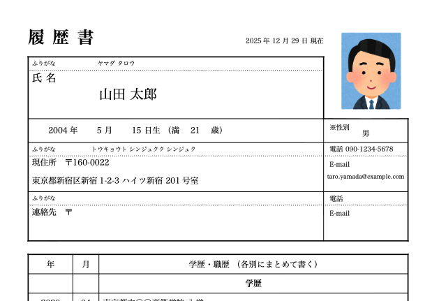

# RenderJPCV

YAML + Typst で JIS規格の履歴書PDFを生成する Node.js CLI



```
For AI Agents & Non-Japanese Speakers:
render-jpcv is a Node.js CLI tool that generates a Japanese JIS-standard Resume (Rirekisho) PDF from a YAML file. It leverages Typst for high-quality rendering. It is designed for developers who want to manage their CVs with version control (Git) and generate PDFs automatically.
```

## 特徴 (Features)

- 📝 YAMLで記述: 履歴書データを構造化されたテキスト（YAML）で管理。Gitでの差分管理と相性抜群です。
- ⚡ 高速PDF生成: Typstエンジンを利用し、美しいJIS様式のPDFを瞬時に出力します。
- 🗂️ アーカイブ運用: 提出日ごとのスナップショット（archive/resume-20251229.yamlなど）を自動作成・ビルド可能です。

## インストール方法(Installation)

```bash
npm init -y
npm install render-jpcv
```

## 使い方（Usage）

### 1) 初期化

作業用フォルダで以下を実行します。

```
npx render-jpcv init
```

生成されるもの:

- `resume.yaml`（あなたが編集する入力）
- `.render-jpcv/`（テンプレ・ビルド情報など）

### 2) PDF生成

```
npx render-jpcv build
```

### 3) アーカイブ運用（archive/ フォルダに保存）

`resume.yaml` の `config.render_date`（例: `2025-12-29`）を元に、提出用スナップショットを作ります。

```
npx render-jpcv archive
npx render-jpcv build archive/resume-20251229.yaml
```

同じ日付が既にある場合は `-2`, `-3`… が付きます（例: `archive/resume-20251229-2.yaml`）。

## 使い方（インストール後）

### グローバルインストール

```
npm i -g render-jpcv
render-jpcv init
render-jpcv build
```

### プロジェクトローカルにインストール

```
npm i -D render-jpcv
npx render-jpcv init
npx render-jpcv build
```

## 出力の仕様

- `build`（引数なし）: ルートに `resume.pdf`
- `build archive/...yaml`: 入力YAMLと同じフォルダにPDF（例: `archive/resume-...pdf`）

## 必要要件

- Node.js 18+

## サンプル

以下は `user-guide/sample-project/resume.yaml` と同様の入力例（アルバイト向けの抜粋）です。ファイル全体は `user-guide/sample-project/resume.yaml` を参照してください。

<details>

<summary>yamlの例</summary>

```yaml
config:
  font_size: 11pt
  # 学生の場合、西暦・和歴どちらでも良いですが、和歴の方が少し堅実な印象を与える場合があります
  year_style: seireki # or wareki
  render_date: 2025-12-29

profile:
  name: 山田 太郎
  name_kana: ヤマダ タロウ
  # 写真パスは環境に合わせて変更してください
  face_image_path: "../syoumeisyashin_man.png"
  birthday: 2004-05-15
  age: 21
  gender: 男

  address_zip: 160-0022
  address: 東京都新宿区新宿1-2-3 ハイツ新宿 201号室
  address_kana: トウキョウト シンジュクク シンジュク
  phone: 090-1234-5678
  email: taro.yamada@example.com

  # 帰省先などがない場合は連絡先欄は省略または同上でOK（ここでは省略）
  # contact_zip: 
  # contact_address: 
  # contact_address_kana: 
  # contact_phone: 
  # contact_email: 

education:
  - date: 2020-04
    event: 東京都立〇〇高等学校 入学
  - date: 2023-03
    event: 東京都立〇〇高等学校 卒業
  - date: 2023-04
    event: 〇〇大学 経済学部 経済学科 入学
  - date: 2027-03
    event: 〇〇大学 経済学部 経済学科 卒業見込み

work:
  - date: 2023-05
    event: コンビニエンスストア〇〇 新宿店 アルバイト入社
    description: レジ打ち、品出し、清掃業務を担当
  - date: 2024-03
    event: コンビニエンスストア〇〇 新宿店 退社
    description: 学業に専念するため
  - date: 2024-04
    event: カフェ・ド・〇〇 渋谷店 アルバイト入社
    description: ホール・キッチン補助。
  - date: 2024-12
    event: カフェ・ド・〇〇 渋谷店 退社
    description: 引越しに伴う通勤困難のため

qualifications:
  - date: 2022-08
    name: 普通自動車第一種運転免許（AT限定） 取得
  - date: 2023-01
    name: 実用英語技能検定 2級 合格

other:
  motivation: |
    以前客として利用した際、スタッフの方々の明るい接客とお店の雰囲気に惹かれ、
    私もその一員として働きたいと思い志望いたしました。
    前職のカフェではホールとキッチン補助を経験しており、
    ピークタイムの忙しい状況でも笑顔で丁寧な対応を心がけていました。
    大学の授業が終わった夕方以降や土日を中心に、長く勤務したいと考えております。

  hopes: |
    【勤務可能日】
    月・水・金：17:00 〜 23:00
    土・日・祝：10:00 〜 23:00
    ※大学の試験期間中（7月・1月）はシフト調整をご相談させていただけますと幸いです。
    【通勤時間】
    約 20 分（電車） 最寄駅：〇〇線 新宿駅
```
</details>

## License

This project is licensed under the MIT License, see the LICENSE.txt file for details
